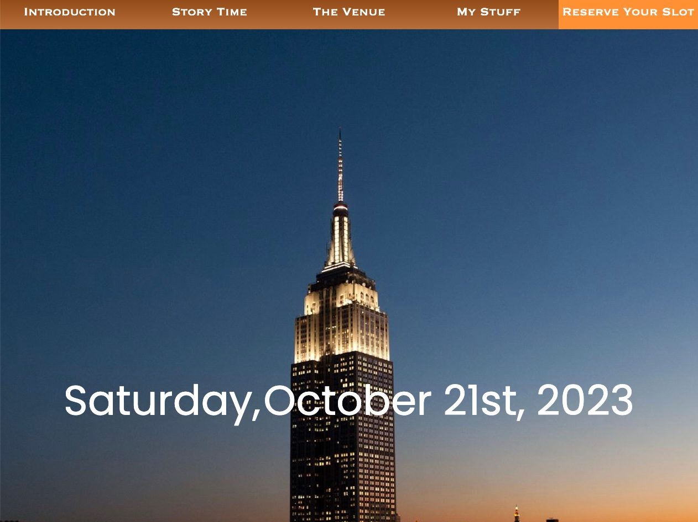
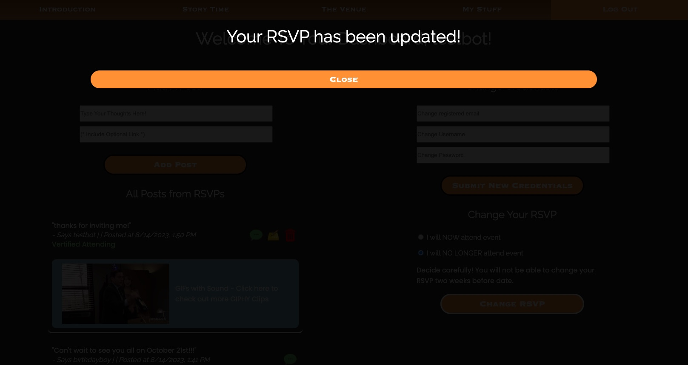

# 10000 Days Party by CS

A full stack application all about my special event I'm hosting soon; A classy party on the day that I turn 10,000 days old! 

The purpose of this application is for attendes to learn more about why I am hosting this event and the venue I chose to host it at. Attendes will have a chance to RSVP on the site while creating an account at the same time. The account will allow the guests to change their RSVP info in case plans change and will also be allowed to interact with other attendes through posts, hyping the event amongst each other until the day of the party arrives.

Optimized for mobile too.

### Credentials
To use ALL features of the app, you need credentials, create a new user or use the sample credentials below:

Email: testbot@gmail.com
Password: password

Instructions are given to the visitor when they visit site!

### Link to Live App
https://cs-10000-days-33ee2045b3a6.herokuapp.com 

### Technologies Used

- Node
- Express
- Handlebars
- Sequelize
- MySQL ('Main' branch)
- PostgreSQL ('PostgreSQL' branch, free heroku add on for PostgreSQL not available at this time)
- Dotenv
- JavaScript

### Tables/Models in Database
- Users
- Posts
- Comments 

### Screenshots

### Installation with Accompanying Data (Seeds)
1. Git clone or download the application and load on VSCode
2. Open your command line, go to the application directory, and run 'npm install'.
    - If this is your first time installing MySQL, please navigate to their documentation for proper installation into your computer and credential creation.
3. Change your package.json scripts to your chosing, preferred to include "start" : "node server.js" as one of your scripts.
4. Create an .env file at the root of the app for Dotenv to run your MySQL credentials for the database. Then in the .env file, type the following and save:
    MYSQLDATABASENAME='just_tech_news_db'
    MYSQLUSER='(YOUR MYSQL USERNAME)'
    MYSQLPASSWORD='(YOUR MYSQL PASSWORD)'
5. Load the MySQL shell in the command line and type the following command to download the original database. Then quit the shell.
    - SOURCE controller/database/db.sql
6. Navigate to server.js and change the value of 'force: false' under the sequelize.sync function to 'force: true'. Save the file.
7. Run 'npm run seeds' in the command line for the database to be synced with its stock data.
8. Revert the value of 'force: true' back to 'force: false' in server.js. Save the file.
9. Run 'npm start' in the command line, then navigate to browser and go to http://localhost:4000

### Future Plans for this Project
1. |COMPLETED| - Switch from a MySQL database to a PostgreSQL database
2. Add Hearts to the database so users can 'heart' posts, similar to Instagram.
3. Convert app into a PWA for users to download to their mobile devices.